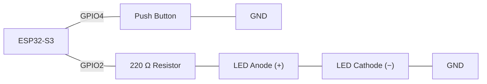
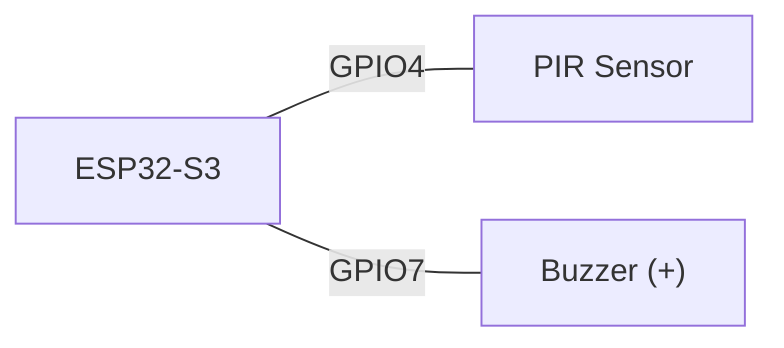
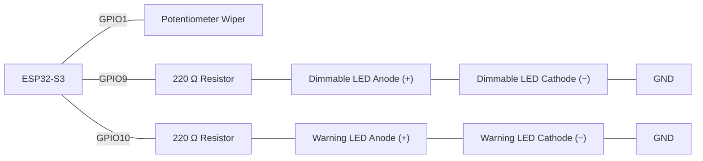
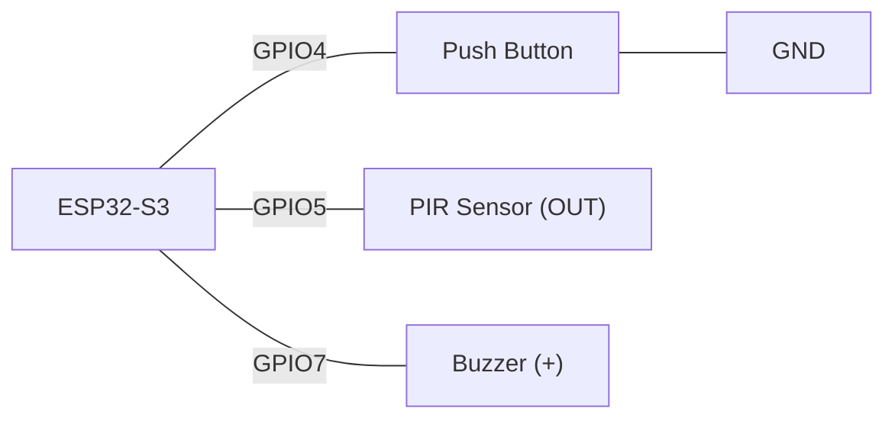
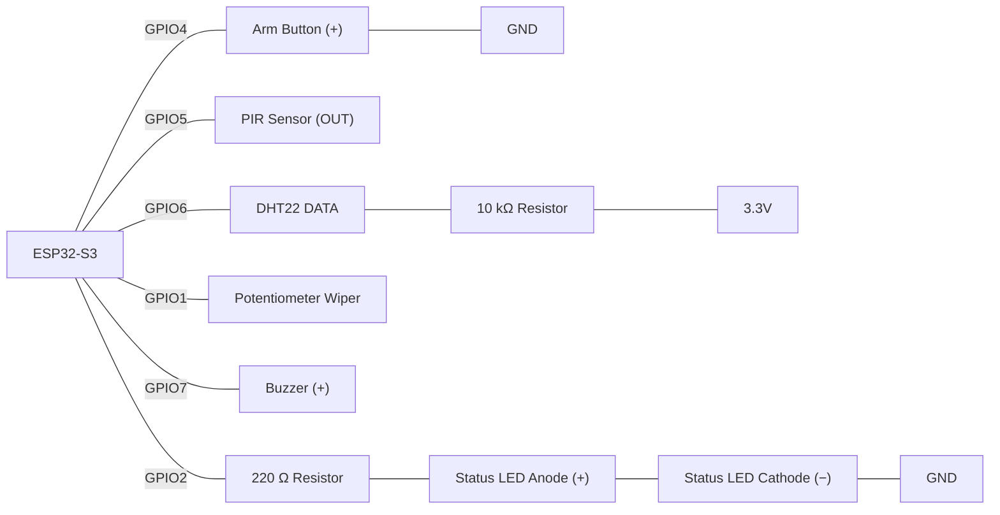

# Activity 3 - Reading Inputs and Selection & Conditional Logic (Week 3)

## Task 1 - Pull-Up Button LED Using `if`

**Scenario:**

A storeroom needs a simple indicator light that turns on for as long as a staff member holds down a wall button, and turns off the instant they let go.

Your task is to program an ESP32-S3 to read a push button wired with the internal pull-up resistor and drive an LED to match.

**Components:**

- ESP32-S3, 1 
- Push button
- LED
- Resistor
- Jumper wires
 
> **Wiring:** 
> 
> 


Configure the button with `INPUT_PULLUP`. Read it every loop with `digitalRead()`. Use a single `if` statement (no `else`) to turn the LED on when pressed, and a second `if` to turn it off when released — practise reasoning about a condition with no `else` branch before Task 2 introduces one.
>
> Wokwi link: https://wokwi.com/projects/472093176967560193
> 
**Check yourself:**
- [ ] The button is configured with `INPUT_PULLUP`, not an external resistor
- [ ] The LED is on only while the button is held down
- [ ] Pressed reads `LOW` and this is reflected correctly in the condition

**Task 1:**
```cpp
/*
=== Task 1 - Pull-Up Button LED Using if ===
          Author: Roberto Palozzo
============================================
*/

int pushButton = 4;
int ledPin = 2;

void setup() {
  // put your setup code here, to run once:
  Serial.begin(115200);
  Serial.println("Hello, ESP32-S3!");
  pinMode(pushButton, INPUT_PULLUP);
  pinMode(ledPin, OUTPUT);
  digitalWrite(ledPin, LOW);
}

void loop() {
  // put your main code here, to run repeatedly:
  int buttonState = digitalRead(pushButton); // Read the current button state.

  // Check whether the button is pressed.
  if (buttonState == LOW) {
    digitalWrite(ledPin, HIGH);
    Serial.println("Button pressed - LED On");
  }
  if  (buttonState == HIGH){    
    digitalWrite(ledPin, LOW);
    Serial.println("Button released - LED Off");
  }
  delay(100);
}
```
https://wokwi.com/projects/472572266370854913

---

## Task 2 - Pull-Down Comparison Using `if / else`

**Scenario:**

The same storeroom light now needs to be rebuilt using a pull-down button instead, so the electronics team can compare both wiring styles side by side.

**Components:**

- ESP32-S3
- Button
- LED
- Resistor
- Jumper wires
  
>**Wiring:** 


Configure the button with `INPUT_PULLDOWN`. This time use one `if / else` statement instead of two separate `if`s. Print `"Pressed"` or `"Released"` to the Serial Monitor from inside each branch.

>
> Wokwi Link https://wokwi.com/projects/472093662810633217
> 
**Check yourself:**
- [ ] The button is configured with `INPUT_PULLDOWN`
- [ ] Pressed reads `HIGH` (opposite of Task 1) and the condition matches
- [ ] A single `if / else` replaces the two separate `if` statements from Task 1

**Task 2:**
```cpp
/*
=== Task 2 - Pull-Down Comparison Using if / else ===
              Author: Roberto Palozzo
=====================================================
*/

int pushButton = 4;
int ledPin = 2;

void setup() {
  // put your setup code here, to run once:
  Serial.begin(115200);
  Serial.println("Hello, ESP32-S3!");
  pinMode(pushButton, INPUT_PULLUP);
  pinMode(ledPin, OUTPUT);
  digitalWrite(ledPin, LOW);
}

void loop() {
  // put your main code here, to run repeatedly:
  int buttonState = digitalRead(pushButton); // Read the current button state.

  // Check whether the button is pressed.
  if (buttonState == LOW) {
    digitalWrite(ledPin, HIGH);
    Serial.println("Button pressed - LED On");
  }
  else {    
    digitalWrite(ledPin, LOW);
    Serial.println("Button released - LED Off");
  }
  delay(100);
}
```
https://wokwi.com/projects/472572028022153217

---

## Task 3 - PIR Motion Alert Using Boolean Logic

**Scenario:**

A warehouse wants a security buzzer that only sounds when motion is detected **and** it's currently after hours — motion during the day (staff walking around) shouldn't trigger anything.

**Components:**

- ESP32-S3
- PIR motion sensor
- Passive buzzer
- Jumper wires.
- 
> **Wiring:** 



Declare `bool afterHours` near the top of your program and set it to `true` or `false` manually to simulate the time of day (no real clock needed). Read the PIR sensor every loop. Use `&&` so the buzzer only sounds when **both** motion is detected **and** `afterHours` is `true`.


>
> Wokwi link: https://wokwi.com/projects/472093910048097281
>
**Check yourself:**
- [ ] The buzzer only sounds when motion **and** `afterHours` are both true
- [ ] Changing `afterHours` to `false` in code stops the buzzer even with motion present
- [ ] (Challenge) `!alarmEnabled` correctly overrides everything else when the system is disabled

**Task 3:**
```cpp
/*
=== Task 3 - PIR Motion Alert Using Boolean Logic ===
              Author: Roberto Palozzo
=====================================================
*/

const int PIR_PIN = 4;              // PIR motion sensor output pin
const int BUZZER_PIN = 15;          // passive buzzer pin

bool afterHours = true;             // manually simulates whether it's after working hours

// Plays a rising/falling siren tone by sweeping the buzzer frequency
// up and down between 600Hz and 1600Hz, one step per call
void startSiren() {
  static int frequency = 600;       // keeps its value between calls (only initialised once)
  static int direction = 20;        // how much to change the frequency each call, and which way

  tone(BUZZER_PIN, frequency);      // play the current frequency
  frequency += direction;           // step the frequency up or down

  if (frequency >= 1600) {
    direction = -20;                // hit the top, start sweeping down
  }
  else if (frequency <= 600) {
    direction = 20;                 // hit the bottom, start sweeping up
  }
}

// Stops the siren sound
void stopSiren() {
  noTone(BUZZER_PIN);
}

void setup() {
  Serial.begin(115200);

  pinMode(PIR_PIN, INPUT);          // PIR sensor as input
  pinMode(BUZZER_PIN, OUTPUT);      // buzzer as output

  stopSiren();                      // make sure the buzzer starts silent
}

void loop() {
  int motionDetected = digitalRead(PIR_PIN);   // read the sensor fresh every loop

  // Sound the alarm only when BOTH conditions are true:
  // motion is detected AND it's currently after hours
  if (afterHours == true && motionDetected == HIGH) {
    startSiren();
    Serial.println("Detected movements. ALARM!");
  }
  else {
    stopSiren();
    Serial.println("Undetected movements. All Good! ");
  }

  delay(100);                       // small pause between readings
}
```
https://wokwi.com/projects/472573140859288577

---

## Task 4 - Potentiometer Dimmer With a Low-Brightness Warning

**Scenario:**

A reading lamp should dim smoothly as a potentiometer knob is turned, but a small indicator LED should light up whenever the brightness is set so low it's barely useful, warning the user.

**Components:**

- ESP32-S3
- Potentiometer
- LED 
- LED (warning indicator)
- Resistors
- Jumper wires
  
> **Wiring:** 



Read the potentiometer with `analogRead()` (0–4095) and convert it to a 0–255 range with `map()`. Drive the dimmable LED with `analogWrite()`. Use an `if / else` so the warning LED turns on whenever brightness is below 25, and off otherwise.

>
> Wokwi link: https://wokwi.com/projects/472094438850270209
> 
**Check yourself:**
- [ ] The dimmable LED's brightness changes smoothly as the knob turns
- [ ] `map()` correctly converts the 0–4095 reading into the 0–255 PWM range
- [ ] The warning LED turns on only when brightness is below the threshold  

**Task 4:**
```cpp
/*
=== Task 4 - Potentiometer Dimmer With a Low-Brightness Warning ===
                    Author: Roberto Palozzo
===================================================================
*/

const int potPin = 1;                               // potentiometer wiper connected to GPIO 1
const int ledPin = 9;                               // dimmable LED connected to GPIO 9
const int warningPin = 10;                          // warning LED connected to GPIO 10

void setup() {
  pinMode(ledPin, OUTPUT);                          // set the dimmable LED pin as an output
  pinMode(warningPin, OUTPUT);                      // set the warning LED pin as an output
  Serial.begin(115200);
}

void loop() {
  int potValue = analogRead(potPin);                // read the potentiometer (0 to 4095)

  int brightness = map(potValue, 0, 4095, 0, 255);  // convert the reading to PWM range (0 to 255)

  analogWrite(ledPin, brightness);                  // set the dimmable LED's brightness

  // turn on the warning LED whenever the brightness is too low to be useful
  if (brightness < 25) {
    digitalWrite(warningPin, HIGH);
  }
  else {
    digitalWrite(warningPin, LOW);
  }

  Serial.println(potValue);                         // raw potentiometer reading
  Serial.println(brightness);                       // mapped PWM value

  delay(100);                                       // small pause: keeps the dimmer smooth while the Serial Monitor stays readable
}
```
https://wokwi.com/projects/472579212917670913

---

## Task 5 - Comfort Monitor Using `if / else if / else`

**Scenario:**

A greenhouse controller needs to classify the current temperature into one of three bands — Cold, Comfortable, or Hot — and show the result on the Serial Monitor, using a DHT22 sensor.

**Components:**

- ESP32-S3
- DHT22 sensor
- Resistor
- Jumper wires
  
> **Wiring:** 


Read the temperature each loop with the DHT library (read no more than once every 2 seconds). Use `if / else if / else`, checking the **most specific/narrow condition first**: below 15 °C → `"Cold"`; 15–29 °C → `"Comfortable"`; 30 °C and above → `"Hot"`. Handle a failed read (`isnan()`) before the temperature check, as shown in the resource notes.

>
> Wokwi link: https://wokwi.com/projects/471760934303645697
> 
**Check yourself:**
- [ ] A failed sensor read is detected with `isnan()` before the temperature is classified
- [ ] Exactly one of the three labels prints per reading, never more than one
- [ ] Conditions are ordered so a later, broader condition can't accidentally catch a case meant for an earlier one


/*
=== Task 5 - Comfort Monitor Using if / else if / else ===
                  Author: Roberto Palozzo
==========================================================
*/

#include <DHT.h>                                  // library for reading DHT-series sensors
#define DHTPIN 2                                  // pin connected to the DHT22 data pin
#define DHTTYPE DHT22                             // sensor model
DHT dht(DHTPIN, DHTTYPE);                         // create the DHT sensor object

void setup() {
  Serial.begin(9600);
  Serial.println("DHT11 Temperature and Humidity Sensor");

  dht.begin();                                    // start the DHT sensor
}

void loop() {
  float humidity = dht.readHumidity();            // read humidity (%)
  float temperature = dht.readTemperature();      // read temperature in Celsius
  
  // isnan() = "is Not a Number" - the DHT library returns NaN instead of
  // a real value when a read fails, so check before using any of the values
  if (isnan(humidity) || isnan(temperature)) {
    Serial.println("Failed to read from DHT22 sensor!");
    delay(2000);
    return;                                       // skip the rest of loop() and try again next time
  }

  // classify the temperature into one of three bands
  // (checked from narrowest/lowest to widest, so no band accidentally catches another's case)
  if (temperature < 15) {
    Serial.println("Cold");
  }
  else if (temperature >= 15 && temperature <= 29) {
    Serial.println("Confortable");
  }
  else {
    Serial.println("Hot");                        // covers 30°C and above (plus the 29-30 gap)
  }

  // print the raw readings
  Serial.print("Humidity: ");
  Serial.print(humidity);
  Serial.println(" %\t");

  Serial.print("Temperature: ");
  Serial.print(temperature);
  Serial.println(" °C\t");

  delay(2000);                                    // DHT22 updates slowly, so wait 2 seconds before the next read
}
```
https://wokwi.com/projects/472582319708664833

---

## Task 6 - Nested `if` Arm/Disarm System

**Scenario:**

A small security system should only watch for motion while "armed." A single push button toggles the system between armed and disarmed each time it's pressed once (not held).

**Components:**

- ESP32-S3
- Push button
- PIR sensor
- Passive buzzer
- Jumper wires
  
> 
> **Wiring:** 
> 



Track `lastButtonState` so you can detect the *edge* of a press (see the resource notes) rather than reacting every loop the button is held down. When a fresh press is confirmed, flip a `bool systemArmed` flag. Nest your logic: only read and react to the PIR sensor **inside** the block where `systemArmed` is `true`; sound the buzzer while motion is detected within that nested block, and make sure the buzzer is stopped whenever the system is disarmed.

Wokwi link: https://wokwi.com/projects/471661119539001345
**Check yourself:**
- [ ] One press toggles the armed state once — holding the button doesn't rapidly toggle it
- [ ] The PIR sensor is only checked when `systemArmed` is `true` (nested inside that condition)
- [ ] The buzzer stops immediately when the system is disarmed, even mid-alarm  

**Task 6**
```cpp
/*
=== Task 6 - Nested if Arm/Disarm System ===
          Author: Roberto Palozzo
============================================
*/

const int ARM_BUTTON_PIN = 4;                          // arm/disarm push button
const int PIR_PIN = 5;                                 // PIR motion sensor output
const int BUZZER_PIN = 7;                              // passive buzzer

bool systemArmed = false;                              // global: current armed/disarmed state
int lastButtonState = HIGH;                            // global: button state from the previous loop, used for edge detection

// Plays a rising/falling siren tone by sweeping the buzzer frequency
// up and down between 600Hz and 1600Hz, one step per call
void startSiren() {
  static int frequency = 600;                          // keeps its value between calls (only set to 600 the very first time)
  static int direction = 20;                           // how much to change frequency each call, and which way (+ or -)

  tone(BUZZER_PIN, frequency);                         // play the current frequency
  frequency += direction;                              // step the frequency for the next call

  if (frequency >= 1600) {
    direction = -20;                                   // reached the top, start sweeping down
  }
  else if (frequency <= 600) {
    direction = 20;                                    // reached the bottom, start sweeping up
  }
}

// Stops the siren sound
void stopSiren() {
  noTone(BUZZER_PIN);
}

void setup() {
  Serial.begin(115200);

  pinMode(ARM_BUTTON_PIN, INPUT_PULLUP);
  pinMode(PIR_PIN, INPUT);
  pinMode(BUZZER_PIN, OUTPUT);

  stopSiren();                                         // make sure the buzzer starts silent
  Serial.println("System disarmed");
}

void loop() {
  int buttonState = digitalRead(ARM_BUTTON_PIN);

  // Detect a fresh press (edge): pressed now, but NOT pressed last loop.
  // Prevents the toggle firing repeatedly while the button is held down.
  if (buttonState == LOW && lastButtonState == HIGH) {
    delay(30);                                         // debounce: wait out any electrical bounce

    if (digitalRead(ARM_BUTTON_PIN) == LOW) {          // confirm it's still pressed after the delay
      systemArmed = !systemArmed;                      // flip the armed state

      if (systemArmed) {
        Serial.println("System armed");
      }
      else {
        stopSiren();                                   // stop any alarm immediately on disarm
        Serial.println("System disarmed");
      }
    }
  }

  lastButtonState = buttonState;                       // update for next loop's edge check (must run every loop)

  // Only watch for motion while the system is armed
  if (systemArmed) {
    int motionDetected = digitalRead(PIR_PIN);

    if (motionDetected == HIGH) {
      startSiren();
    }
    else {
      stopSiren();
    }
  }
  else {
    stopSiren();                                       // extra safety: buzzer always off while disarmed
  }

  delay(100);
}
```
https://wokwi.com/projects/472587460876988417

---

## Task 7 - Spot-the-Bug Worksheet (Extension)

**Round 1:**
```cpp
void setup() {
  pinMode(BUTTON_PIN, INPUT_PULLUP);            // With INPUT_PULLUP the buttonState must be LOW.
  pinMode(LED_PIN, OUTPUT);
}

void loop() {
  int buttonState = digitalRead(BUTTON_PIN);

  if (buttonState == HIGH) {                    // It must be: if (buttonState == LOW) {
    digitalWrite(LED_PIN, HIGH);
    Serial.println("Button pressed");
  }
}
```
<details><summary>Answer</summary>With <code>INPUT_PULLUP</code>, a press reads <code>LOW</code>, not <code>HIGH</code> — the condition has the logic backwards, so the LED lights when the button is released instead of pressed.</details>

**Round 2:**
```cpp
void loop() {
  int potValue = analogRead(potPin);
  int brightness = map(potValue, 0, 255, 0, 4095); // Reversed ranges in map(): should be map(potValue, 0, 4095, 0, 255).
  analogWrite(ledPin, brightness);
}
```
<details><summary>Answer</summary>The <code>map()</code> arguments are reversed — the potentiometer reading is 0–4095 and needs to map <em>into</em> 0–255 for <code>analogWrite()</code>. It should be <code>map(potValue, 0, 4095, 0, 255)</code>.</details>

**Round 3:**
```cpp
void loop() {
  int motionDetected = digitalRead(PIR_PIN);

  if (motionDetected = HIGH) {    //Here we are inside an "if" statement.  
  //It involves comparing one value with another, which is done with ==.  
  // Here, a value has been assigned with =.
    digitalWrite(BUZZER_PIN, HIGH);
  }
}
```
<details><summary>Answer</summary><code>=</code> is assignment, not comparison — this always sets the condition true regardless of the sensor. It should be <code>if (motionDetected == HIGH)</code>.</details>

**Round 4:**
```cpp
void loop() {   // isnan() = "is Not a Number" is totally missing
  float humidity = dht.readHumidity();
  float temperatureC = dht.readTemperature();

  Serial.print("Temp: ");
  Serial.println(temperatureC);

  delay(100);   // delay is too short and the sensor can give wrong data
}
```
<details><summary>Answer</summary>Two problems: there's no <code>isnan()</code> check for a failed read, and the DHT22 is polled every 100 ms — it can only be read reliably about once every 2 seconds, so this will frequently return stale or invalid data.</details>

**Round 5:**
```cpp
void loop() {
  int redButton = digitalRead(redButtonPin);    // Is missing the part for the green button
                                                // int greenButton = digitalRead(greenButtonPin);

  if (redButton == LOW) {
    digitalWrite(redLED, HIGH);
  } else if (redButton == LOW) {                // this must be: } else if (greenButton == LOW) {
    digitalWrite(greenLED, HIGH);
  }
}
```
<details><summary>Answer</summary>Both branches check the exact same condition (<code>redButton == LOW</code>) — the second, unreachable branch was meant to check a different variable, e.g. <code>greenButton == LOW</code>.</details>

**Round 6:**
```cpp
bool systemArmed = false;
// Edge detection is missing (no comparison with lastButtonState).  
// While the button is held down, systemArmed flips multiple  
// times rapidly in 10ms, instead of changing once per press.
void loop() {
  int buttonState = digitalRead(ARM_BUTTON_PIN);

  if (buttonState == LOW) {
    systemArmed = !systemArmed;
  }

  Serial.println(systemArmed);
  delay(10);
}
```
<details><summary>Answer</summary>There's no edge detection (no <code>lastButtonState</code> comparison) — while the button is held down, this toggles <code>systemArmed</code> on almost every single loop iteration (every ~10 ms), instead of once per physical press.</details>

**Round 7:**
```cpp
void loop() {
  int motionDetected = digitalRead(PIR_PIN);
  bool afterHours = true;

  if (motionDetected == HIGH) {
    if (afterHours) {
    }
    digitalWrite(BUZZER_PIN, HIGH);
  }
}
```
<details><summary>Answer</summary>The nested <code>if (afterHours)</code> block is empty — <code>digitalWrite(BUZZER_PIN, HIGH)</code> sits outside it, so the buzzer fires on motion alone and <code>afterHours</code> has no effect at all. The buzzer line needs to move inside the nested block.</details>

**Self-check:** How many did you spot correctly before looking?

---

## Task 8 - Smart Environment Monitor 

**Scenario:**

A community garden shed needs one combined monitoring system: it should only run its full logic while "armed" via a button, warn about unwanted humans after hours using the PIR sensor, warn about greenhouse conditions using the DHT22, and let a potentiometer act as a manual override for the alert buzzer's volume/duration via PWM-controlled intensity — bringing together every input type and every selection structure from this week.

**Components:**

- ESP32-S3
- Push button
- PIR sensor
- DHT22 sensor with 10 kΩ resistor,
- Potentiometer
- Passive buzzer
- LED
- Resistors
- Jumper wires

> 
> **Wiring**
> 



**Program requirements:**
1. **Edge-detected toggle (nested `if`):** A single press of the arm button (debounced, edge-detected as in Task 6) flips `bool systemArmed`. The status LED should be on whenever `systemArmed` is `true`.
2. **Nested `if` for motion:** Only when `systemArmed` is `true`, read the PIR sensor. Nest a second check inside: `if (motionDetected == HIGH && afterHours)` sounds the buzzer (use a `bool afterHours` flag set manually, as in Task 3).
3. **`if / else if / else` for climate:** Read the DHT22 (no more than once every 2 seconds) and classify temperature as `"Cold"`, `"Comfortable"`, or `"Hot"` as in Task 5, printing the result and the humidity to Serial regardless of the armed state.
4. **Potentiometer override:** Read the potentiometer and `map()` it to a 0–255 range. Use this value as the buzzer's PWM intensity (`analogWrite`) whenever the motion alert is active, so turning the knob controls how loud/intense the alert is.
5. Handle a failed DHT22 read with `isnan()` before using its values in any condition.

**Suggested sequence in `loop()`:**
1. Check the arm button for a fresh press (edge detection) → toggle `systemArmed`, update the status LED.
2. If `systemArmed`: read the PIR sensor; if motion **and** `afterHours`, read the potentiometer and drive the buzzer with `analogWrite()` at that intensity; otherwise keep the buzzer off.
3. Independently of the armed state: read the DHT22, check for a failed read, then classify and print the temperature band and humidity.

**Check yourself:**
- [ ] The arm button toggles `systemArmed` once per physical press, not repeatedly while held
- [ ] The PIR sensor and buzzer logic only run when `systemArmed` is `true` (nested correctly)
- [ ] The buzzer only activates when motion **and** `afterHours` are both true
- [ ] The potentiometer's mapped value visibly changes the buzzer's PWM intensity
- [ ] The DHT22 read is guarded with `isnan()` and never polled faster than every 2 seconds
- [ ] Temperature classification uses `if / else if / else` with conditions ordered correctly (narrowest first)

---

## Questions

Answer these in your own words before moving on:
1. Why does `INPUT_PULLUP` read `LOW` when pressed, while `INPUT_PULLDOWN` reads `HIGH` when pressed?
  ```


  ```
2. What's the practical difference between `if`, `if / else`, and `if / else if / else` in terms of how many branches can run per loop?
  ```


  ```
3. Why does `&&` require both conditions to be true, while `||` only needs one? Give a real-world example of each from this activity.
  ```


  ```
4. In Task 6/8, why is edge detection (comparing to `lastButtonState`) necessary instead of just checking `if (buttonState == LOW)` on its own?

  ```


  ```
5. Why must the most specific condition be checked first in an `if / else if / else` chain?
  ```


  ```

6. Why does the DHT22 need to be read with `millis()`-style timing instead of a short `delay()`, unlike a button or PIR sensor?
  ```


  ```


