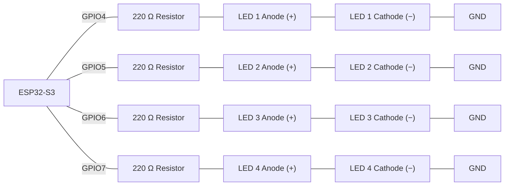
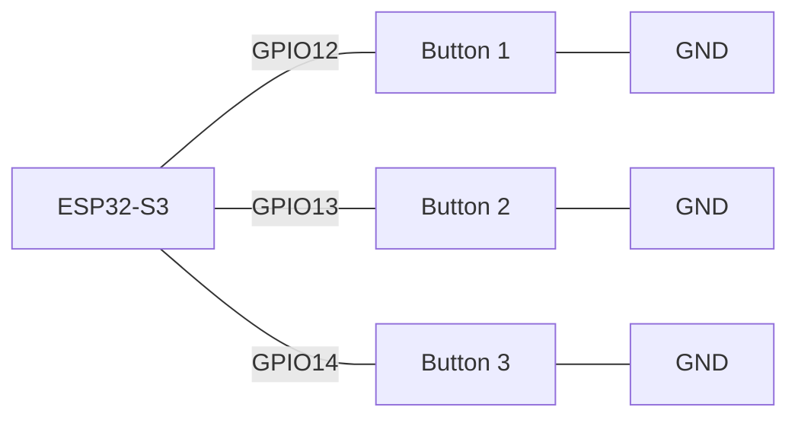
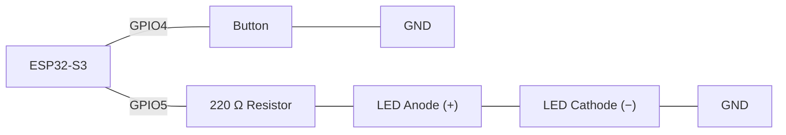
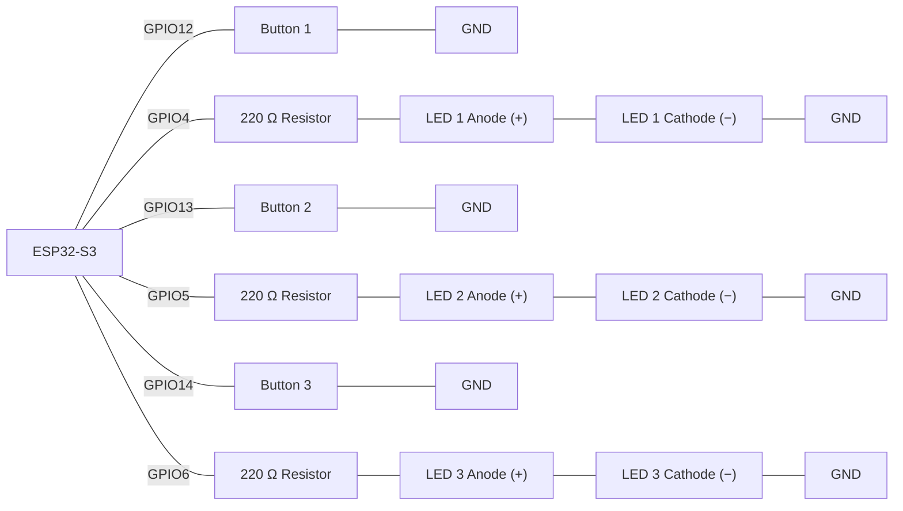
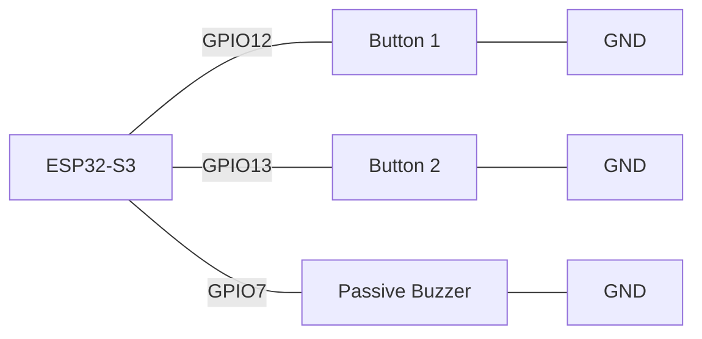

# Activity 5 - Lists, Arrays & Loops 

## Task 1 - LED Chaser Using an Array and a For Loop

**Scenario:**

A control panel needs a 4-LED "chaser" light — a sweeping indicator like a loading bar — driven entirely by an array of pin numbers and a `for` loop, so adding a fifth LED later means changing the array, not rewriting the sequence logic.

**Components:**

- ESP32-S3 development board
- 4x LED
- 4x 220 Ω resistor
- Jumper wires

> **Wiring:**



Declare `const int ledPins[4] = {4, 5, 6, 7};` and `const unsigned long STEP_INTERVAL = 150;`. Track `int currentIndex = 0`, `int direction = 1`, and `unsigned long previousStepMillis = 0`. Write `led_chaser()` so that every `STEP_INTERVAL` ms — checked with `millis()`, never `delay()` — it turns off the LED at `currentIndex`, then, if `currentIndex + direction` would fall outside the array (below `0` or above `3`), flips `direction` between `1` and `-1` before advancing `currentIndex` by `direction` and turning that LED on. This makes the chaser sweep to one end of the array, reverse, sweep back to the other end, and keep bouncing back and forth continuously rather than restarting from index 0 every cycle. Call `led_chaser()` from `loop()` every pass — the `millis()` check inside it decides when a step actually happens. `setup()` must still use a `for` loop over `ledPins` to configure every pin as `OUTPUT` — no pin number should appear hard-coded anywhere outside the array.

>
> Wokwi link: https://wokwi.com/projects/473652460611573761

**Check yourself:**
- [ ] No `delay()` anywhere; stepping is timed with `millis()` and `STEP_INTERVAL`
- [ ] Exactly one LED is lit at any moment
- [ ] Reaching either end of `ledPins[]` reverses `direction`, so the chaser bounces back and forth instead of restarting from index 0
- [ ] No pin number is hard-coded anywhere outside `ledPins[]`

**Task 1**
```cpp
/*
=== Task 1 - LED Chaser Using an Array and a For Loop ===
           Author: Roberto Palozzo
=========================================================
*/

// ---------- Pin delle zone (paralleli, stesso indice i) ----------
constexpr uint8_t LED_PINS[4]    = {4, 5, 6, 7};   // LED nell'array
const unsigned long STEP_INTERVAL = 150;
unsigned long previousStepMillis = 0;

void setup() {  
  for (int i = 0; i < 4; i++) {
    pinMode(LED_PINS[i], OUTPUT);
    digitalWrite(LED_PINS[i], LOW);
  }
}

void led_chaser() {
  static int currentIndex = 0;
  static int direction =1;

  if (millis() - previousStepMillis >= STEP_INTERVAL) {
    digitalWrite(LED_PINS[currentIndex], LOW);   // spegne il LED attuale

    if (currentIndex + direction < 0 || currentIndex + direction > 3) {
      direction = -direction;
    }
    currentIndex += direction;

    digitalWrite(LED_PINS[currentIndex], HIGH);  // accende il nuovo LED

    previousStepMillis = millis();
  }
}

void loop() {
  led_chaser();
}
```
Wokwi link: https://wokwi.com/projects/473854001390447617

---
## Task 2 - Burst-Sampling a Button Panel

**Scenario:**

A workshop wants to quickly test a panel of 3 buttons at once. For each button in turn, the board should read it 10 times in rapid succession and print the whole burst — a first, brute-force look at how "noisy" each switch's signal actually is before worrying about doing anything smarter with it.

**Components:**

- ESP32-S3 development board
- 3x push button (`INPUT_PULLUP`)
- Jumper wires

> **Wiring:**



Declare `const int buttonPins[3] = {12, 13, 14};` and `const int MAX_READINGS = 10;`, with a reusable `int readings[MAX_READINGS];` and `int reading_count`. Write `capture_all_buttons()` with an **outer** `for` loop that walks each button in `buttonPins[]`, and an **inner** `for` loop that bursts-samples the current button 10 times (5 ms apart), resetting `reading_count` to 0 at the start of every button and storing each sample at `readings[reading_count]` before incrementing it. After each button's inner loop finishes, print all `reading_count` captured samples for that button, labelled with its pin number. Call `capture_all_buttons()` from `loop()`, with a 2-second gap between full sweeps.

>
> Wokwi link: https://wokwi.com/projects/473651805811447809

**Task 2**
```cpp
/*
=== Task 2 - Burst-Sampling a Button Panel ===
           Author: Roberto Palozzo
==============================================
*/

constexpr uint8_t buttonPins[3] {12, 13, 14};   // GPIO pins for the three buttons
constexpr uint8_t MAX_READINGS = 10;            // How many samples to take per button, per burst
const int NUM_BUTTONS = 3;                      // How many buttons are in buttonPins[]

int readings[MAX_READINGS];                     // Reusable buffer: holds the burst readings for one button at a time
int reading_count = 0;                          // How many of the 10 slots in readings[] are actually filled right now

void setup() {
  Serial.begin(9600);

  // Configure every button pin with the internal pull-up resistor
  for (int i = 0; i < NUM_BUTTONS; i++) {
    pinMode(buttonPins[i], INPUT_PULLUP);
  }
}

void capture_all_buttons() {

  // Outer loop: walk through each button in turn
  for (int b = 0; b < NUM_BUTTONS; b++) {
    reading_count = 0;                          // Reset the counter — we're about to fill readings[] for a new button

    // Inner loop: burst-sample the current button MAX_READINGS times, 5ms apart
    for (int i = 0; i < MAX_READINGS; i++) {
      // LOW means pressed, HIGH means released (INPUT_PULLUP)
      readings[reading_count] = digitalRead(buttonPins[b]);

      reading_count++;
      delay(5);
    }

    // Print a header identifying which button and pin this burst belongs to
    Serial.print("Button ");
    Serial.print(b + 1);
    Serial.print(" on GPIO ");
    Serial.print(buttonPins[b]);
    Serial.print(": ");

    // Print only the samples actually captured (reading_count), not the full array capacity
    for (int i = 0; i < reading_count; i++) {
      Serial.print(readings[i]);
      Serial.print(" ");
    }

    Serial.println();
  }
}

void loop() {
  capture_all_buttons();
  delay(2000);
}
```
Wokwi link: https://wokwi.com/projects/474025336170863617

---
## Task 3 - Debouncing a Single Button, Properly

**Scenario:**

A single button controls one LED, but a plain `digitalRead()` check makes the LED flicker unpredictably the instant the button is pressed or released — the mechanical contacts are bouncing. Fix it using the "wait for the reading to settle" technique, not by taking a burst of samples.

**Components:**

- ESP32-S3 development board
- 1x push button (`INPUT_PULLUP`)
- 1x LED
- 1x 220 Ω resistor
- Jumper wires

> **Wiring:**



Track three pieces of state: `int lastButtonReading` (the raw `digitalRead()` from the previous pass), `unsigned long debounceStart` (when that raw reading last changed), and `int buttonState` (the debounced, trusted state). On every pass of `loop()`: read the pin: if the raw reading differs from `lastButtonReading`, record `millis()` into `debounceStart`. Separately, if `millis() - debounceStart` has exceeded `DEBOUNCE_TIME` (50 ms) **and** the raw reading differs from `buttonState`, update `buttonState` and toggle the LED only on that transition. Update `lastButtonReading` at the end of every pass. No `delay()` anywhere.

>
> Wokwi link: https://wokwi.com/projects/473653428507075585

**Check yourself:**
- [ ] `debounceStart` is reset every time the *raw* reading changes, not every pass
- [ ] The LED only toggles once the reading has stayed stable for `DEBOUNCE_TIME`, and only on a genuine change of `buttonState`
- [ ] `millis()` is used for all timing; there is no `delay()` anywhere in `loop()`
- [ ] Pressing and releasing the button quickly toggles the LED cleanly once per press, with no flicker.

**Task 3**
```cpp
/*
=== Task 3 - Debouncing a Single Button, Properly ===
               Author: Roberto Palozzo
=====================================================
*/

constexpr uint8_t buttonPin = 4;
constexpr uint8_t ledPin = 5;

const unsigned long DEBOUNCE_TIME = 50;

int lastButtonReading = HIGH;
int buttonState = HIGH;

unsigned long debounceStart = 0;

void setup() {
  Serial.begin(9600);
  pinMode(buttonPin, INPUT_PULLUP);
  pinMode(ledPin, OUTPUT);
  digitalWrite(ledPin, LOW);
}

void loop() {
  int reading = digitalRead(buttonPin);

  if (reading != lastButtonReading){
    debounceStart = millis();
  }

  if (millis() - debounceStart >= DEBOUNCE_TIME) {
    
    if (reading != buttonState) {
        buttonState = reading;
      
      if (buttonState == LOW) {
          digitalWrite(ledPin, HIGH);
          Serial.println("led ON");
      }

      else {
        digitalWrite(ledPin, LOW);
        Serial.println("led OFF");
      }
    }
  }

  lastButtonReading = reading;
}
```
Wokwi link: https://wokwi.com/projects/474198442818673665

---

## Task 4 - Parallel Arrays: Debounced Button/LED Pairs, Non-Blocking Cycles

**Scenario:**

Extend Task 3's debounce technique across 3 independent button/LED pairs at once, and wrap the whole check in a repeating, non-blocking test cycle — so one button bouncing never delays reading the other two, and nothing in the program ever blocks.

**Components:**

- ESP32-S3 development board
- 3x push button (`INPUT_PULLUP`)
- 3x LED
- 3x 220 Ω resistor
- Jumper wires

> **Wiring:**



Declare parallel arrays `const int buttonPins[3] = {12, 13, 14};` and `const int ledPins[3] = {4, 5, 6};` — index `i` pairs one button with one LED. Give each pair its own debounce state using per-index arrays: `int lastButtonReading[3]`, `unsigned long debounceStart[3]`, and `bool buttonState[3]`, following exactly the same per-button logic as Task 3 but inside a `for` loop over all 3 pairs. Whenever a pair's debounced state changes to pressed, drive its matching LED on (and off on release). Wrap the whole check in a `millis()`-gated timer (`CYCLE_INTERVAL = 1000`) so a full pass over all 3 pairs happens once a second, not every single loop iteration — but keep the debounce timing itself checked every pass, independent of the cycle gate.

>
> Wokwi link: https://wokwi.com/projects/473326289925248001

**Check yourself:**
- [ ] `buttonPins[]` and `ledPins[]` are parallel arrays — index `i` always refers to the same pair in both
- [ ] Each pair has its own debounce state (`lastButtonReading[i]`, `debounceStart[i]`, `buttonState[i]`), not one shared set of variables
- [ ] Debouncing one pair never delays or blocks debouncing the others
- [ ] No `delay()` anywhere; the cycle gate uses `millis()` and `CYCLE_INTERVAL`

**Task 4**
```cpp
/*
=== Task 4 - Parallel Arrays: Debounced Button/LED Pairs, Non-Blocking Cycles ===
                              Author: Roberto Palozzo
=================================================================================
*/

constexpr uint8_t buttonPins[3] {12, 13, 14};            // GPIO pins for the three buttons
constexpr uint8_t ledPins[3] = {4, 5, 6};                // GPIO pins for the three matching LEDs
constexpr int NUM_PAIRS = 3;                             // Number of button/LED pairs
constexpr unsigned long CYCLE_INTERVAL = 1000;           // How often (ms) to print a status report
constexpr unsigned long DEBOUNCE_TIME = 50;              // How long (ms) a reading must stay stable to count as real

int lastButtonReading[NUM_PAIRS] = {HIGH, HIGH, HIGH};   // Last raw reading seen for each pair (unfiltered)
int buttonState[NUM_PAIRS] = {HIGH, HIGH, HIGH};         // Debounced, stable state for each pair
int currentCycle = 0;                                    // Counts how many status reports have been printed
unsigned long previousCycleMillis = 0;                   // When the last status report was printed
unsigned long debounceStart[NUM_PAIRS];                  // When each pair's raw reading last changed (auto-init to 0)

void setup() {
  Serial.begin(115200);
  for (int i = 0; i < NUM_PAIRS; i++) {
    pinMode(buttonPins[i], INPUT_PULLUP);
    pinMode(ledPins[i], OUTPUT);
    digitalWrite(ledPins[i], LOW);                       // Make sure every LED starts off
  }
}

// Runs on every pass of loop(): debounces all 3 pairs independently, no delay() involved
void check_buttons() {

  unsigned long currentMillis = millis();

  for (int button = 0; button < NUM_PAIRS; button++) {
    int reading = digitalRead(buttonPins[button]);

    // Raw reading changed: restart this pair's debounce timer
    if (reading != lastButtonReading[button]) {
      debounceStart[button] = currentMillis;
    }

    // Reading has stayed stable long enough to trust it
    if (currentMillis - debounceStart[button]
        >= DEBOUNCE_TIME) {

      // Only act if the stable state actually changed
      if (reading != buttonState[button]) {
        buttonState[button] = reading;

        // INPUT_PULLUP means a pressed button reads LOW
        if (buttonState[button] == LOW) {
          Serial.print("Button selected: ");
          Serial.println(button + 1);
          digitalWrite(ledPins[button], HIGH);
        }
        else {
          digitalWrite(ledPins[button], LOW);
        }
      }
    }

    lastButtonReading[button] = reading;                 // Save this pass's raw reading for next time
  }
}

// Runs once per second (CYCLE_INTERVAL): reports the already-debounced state, doesn't re-read the pins
void report_cycle() {

  unsigned long currentMillis = millis();

  if (currentMillis - previousCycleMillis >= CYCLE_INTERVAL) {
    previousCycleMillis = currentMillis;

    Serial.print("Cycle ");
    Serial.print(currentCycle);
    Serial.print(": ");

    for (int button = 0; button < NUM_PAIRS; button++) {
      Serial.print(buttonState[button]);
      Serial.print(" ");
    }
    Serial.println();

    currentCycle++;
  }
}

void loop() {
  check_buttons();
  report_cycle();
}
```
Wokwi link: https://wokwi.com/projects/474219655371849729

---

## Task 5 - Arrays: A Two-Song Melody Selector

**Scenario:**

Build a simple 2-button music box: pressing Button 1 or Button 2 plays a different short tune on a buzzer, note by note, without blocking the rest of the program. Each song's notes and their durations live in a 2-D array, one row per song.

**Components:**

- ESP32-S3 development board
- 2x push button (`INPUT_PULLUP`)
- 1x passive buzzer
- Jumper wires

> **Wiring:**



Declare `const int NUM_SONGS = 2;` and `const int NUM_NOTES = 8;`, then `int melodies[NUM_SONGS][NUM_NOTES]` and `int noteDurations[NUM_SONGS][NUM_NOTES]` holding two short 8-note tunes of your choosing (use named note constants like `NOTE_C4 = 262`, not raw frequency numbers). Track `int currentSong`, `int currentNote`, `bool songPlaying`, and `unsigned long noteStartTime`. On a plain `digitalRead()` press of either button (debouncing isn't the focus here — that's Task 6), start that song: set `currentSong`, reset `currentNote` to 0, and call `tone()` for the first note. In `loop()`, use `millis()` to check whether the current note's duration has elapsed; if so, move to `melodies[currentSong][currentNote]` for the next note (`currentNote++`), or stop the buzzer once `currentNote` reaches `NUM_NOTES`. No `delay()` — the buttons must stay readable while a song plays.

>
> Wokwi link: https://wokwi.com/projects/473653874488503297

**Check yourself:**
- [ ] `melodies[][]` and `noteDurations[][]` are indexed consistently as `[song][note]` everywhere
- [ ] The correct song's row is selected by `currentSong`, and playback advances through `currentNote` from 0 up to (not including) `NUM_NOTES`
- [ ] Note timing uses `millis()`, not `delay()` — both buttons are still readable while a song plays
- [ ] Pressing the other button mid-song correctly switches to the new song

**Task 5**
```cpp
/*
=== Task 5 - Arrays: A Two-Song Melody Selector ===
            Author: Roberto Palozzo
===================================================
*/

const int buttonPins[2] = {12, 13};      // GPIO pins for the two song-select buttons
const int buzzerPin = 7;                 // GPIO pin for the passive buzzer
const int NUM_SONGS = 2;                 // How many songs are stored
const int NUM_NOTES = 8;                 // How many notes each song has
const int NOTE_C4 = 262, NOTE_D4 = 294, NOTE_E4 = 330, NOTE_G4 = 392;  // Named note frequencies
const int NUM_BUTTONS = 2;               // How many buttons are in buttonPins[]

// Each row holds one song's 8 note frequencies; row index = song number
int melodies[NUM_SONGS][NUM_NOTES] = {
  {NOTE_C4, NOTE_C4, NOTE_G4, NOTE_G4, NOTE_C4, NOTE_C4, NOTE_G4, NOTE_G4},
  {NOTE_E4, NOTE_D4, NOTE_C4, NOTE_D4, NOTE_E4, NOTE_E4, NOTE_E4, 0}
};

// Each row holds how long (ms) each corresponding note in melodies[] should play
int noteDurations[NUM_SONGS][NUM_NOTES] = {
  {300, 300, 300, 300, 300, 300, 300, 300},
  {300, 300, 300, 300, 300, 300, 300, 300}
};

int currentSong = 0;                     // Which song is currently selected/playing
int currentNote = 0;                     // Which note of that song is currently playing
bool songPlaying = false;                // Whether a song is currently in progress
unsigned long noteStartTime = 0;         // When the current note started, for millis()-based timing

void setup() {
  Serial.begin(9600);
  pinMode(buzzerPin, OUTPUT);
  for (int i = 0; i < NUM_BUTTONS; i++) {
    pinMode(buttonPins[i], INPUT_PULLUP);
  }
}

// Begins playing the given song from its first note
void startSong(int song) {
  currentSong = song;
  currentNote = 0;
  songPlaying = true;

  int frequency = melodies[currentSong][currentNote];
  tone(buzzerPin, frequency);

  noteStartTime = millis();   // Record when this first note started
}

// Runs on every pass of loop(): advances to the next note once the current one's duration has elapsed
void updateSong() {

  // Nothing to do if no song is playing
  if (!songPlaying) {
    return;
  }

  unsigned long currentMillis = millis();

  // Has the current note played for its full duration?
  if (currentMillis - noteStartTime >= noteDurations[currentSong][currentNote]) {
    noTone(buzzerPin);
    currentNote++;

    if (currentNote >= NUM_NOTES) {
      songPlaying = false;    // No more notes left: the song has finished
    }
    else {
      // Still notes left: start the next one
      int frequency = melodies[currentSong][currentNote];
      tone(buzzerPin, frequency);
      noteStartTime = millis();
    }
  }
}

void loop() {
  // Direct digitalRead() check on each button
  if (digitalRead(buttonPins[0]) == LOW) {
    startSong(0);
  }
  if (digitalRead(buttonPins[1]) == LOW) {
    startSong(1);
  }

  updateSong();   // Always runs, so playback keeps advancing without blocking the buttons
}
```
Wokwi link: https://wokwi.com/projects/474317257879396353

---

## Task 6 - Combine: Debounced Two-Song Melody Selector

**Scenario:**

Task 5's plain button reads occasionally restart a song twice from one press, or miss a press entirely — switch bounce again. Fix it by adding Task 3's proper debounce technique, now as per-button arrays sized for the 2 buttons (as in Task 4), so a song only ever starts on a genuine, settled press.

**Components:** Same as Task 5.

> **Wiring:**


Add `int lastButtonReading[2]`, `unsigned long debounceStart[2]`, and `int buttonState[2]` — one entry per button. Replace Task 5's plain `digitalRead()` checks with the settle-based debounce logic from Task 3/4, applied in a `for` loop over both buttons. Only call `startSong(button)` when a button's debounced state has just transitioned to pressed — never on a raw, unsettled reading.

>
> Wokwi link: https://wokwi.com/projects/473653874488503297

**Check yourself:**
- [ ] Debounce state (`lastButtonReading[]`, `debounceStart[]`, `buttonState[]`) is a separate array entry per button, not shared
- [ ] `startSong()` is only called on a debounced press-edge, never on every raw `LOW` reading
- [ ] The melody playback logic from Task 5 (note timing via `millis()`) is unchanged
- [ ] Rapidly pressing a button doesn't restart or glitch the song mid-press

**Task 6**
```cpp
/*
=== Task 6 - Combine: Debounced Two-Song Melody Selector ===
                  Author: Roberto Palozzo
============================================================
*/

constexpr uint8_t buttonPins[2] = {12, 13};         // GPIO pins for the two song-select buttons
constexpr uint8_t buzzerPin = 7;                    // GPIO pin for the passive buzzer
constexpr int NUM_SONGS = 2;                        // How many songs are stored
constexpr int NUM_NOTES = 8;                        // How many notes each song has
constexpr int NOTE_C4 = 262, NOTE_D4 = 294, NOTE_E4 = 330, NOTE_G4 = 392;  // Named note frequencies
constexpr int NUM_BUTTONS = 2;                      // How many buttons are in buttonPins[]
constexpr unsigned long DEBOUNCE_TIME = 50;         // How long (ms) a reading must stay stable to count as real

// Each row holds one song's 8 note frequencies; row index = song number
int melodies[NUM_SONGS][NUM_NOTES] = {
  {NOTE_C4, NOTE_C4, NOTE_G4, NOTE_G4, NOTE_C4, NOTE_C4, NOTE_G4, NOTE_G4},
  {NOTE_E4, NOTE_D4, NOTE_C4, NOTE_D4, NOTE_E4, NOTE_E4, NOTE_E4, 0}
};

// Each row holds how long (ms) each corresponding note in melodies[] should play
int noteDurations[NUM_SONGS][NUM_NOTES] = {
  {300, 300, 300, 300, 300, 300, 300, 300},
  {300, 300, 300, 300, 300, 300, 300, 300}
};

int currentSong = 0;                                // Which song is currently selected/playing
int currentNote = 0;                                // Which note of that song is currently playing
int lastButtonReading[NUM_BUTTONS] = {HIGH, HIGH};  // Last raw reading seen for each button (unfiltered)
int buttonState[NUM_BUTTONS] = {HIGH, HIGH};        // Debounced, stable state for each button
bool songPlaying = false;                           // Whether a song is currently in progress
unsigned long noteStartTime = 0;                    // When the current note started, for millis()-based timing
unsigned long debounceStart[2];                     // When each button's raw reading last changed (auto-init to 0)

void setup() {
  Serial.begin(9600);
  pinMode(buzzerPin, OUTPUT);
  for (int i = 0; i < NUM_BUTTONS; i++) {
    pinMode(buttonPins[i], INPUT_PULLUP);
  }
}

// Runs on every pass of loop(): debounces both buttons independently
void check_buttons() {
  unsigned long currentMillis = millis();

  for (int btn = 0; btn < NUM_BUTTONS; btn++) {
    int reading = digitalRead(buttonPins[btn]);

    // Raw reading changed: restart this button's debounce timer
    if (reading != lastButtonReading[btn]) {
      debounceStart[btn] = currentMillis;
    }

    // Reading has stayed stable long enough to trust it
    if (currentMillis - debounceStart[btn]
        >= DEBOUNCE_TIME) {

      // Only act if the stable state actually changed
      if (reading != buttonState[btn]) {
        buttonState[btn] = reading;

        // INPUT_PULLUP means a pressed button reads LOW: start that song on the press edge only
        if (buttonState[btn] == LOW) {
          startSong(btn);
        }
      }
    }

    lastButtonReading[btn] = reading;               // Save this pass's raw reading for next time
  }
}

// Begins playing the given song from its first note
void startSong(int song) {
  currentSong = song;
  currentNote = 0;
  songPlaying = true;

  int frequency = melodies[currentSong][currentNote];
  tone(buzzerPin, frequency);

  noteStartTime = millis();                         // Record when this first note started
}

// Runs on every pass of loop(): advances to the next note once the current one's duration has elapsed
void updateSong() {
  // Nothing to do if no song is playing
  if (!songPlaying) {
    return;
  }

  unsigned long currentMillis = millis();

  // Has the current note played for its full duration?
  if (currentMillis - noteStartTime >= noteDurations[currentSong][currentNote]) {
    noTone(buzzerPin);
    currentNote++;

    if (currentNote >= NUM_NOTES) {
      songPlaying = false;                          // No more notes left: the song has finished
    }
    else {
      // Still notes left: start the next one
      int frequency = melodies[currentSong][currentNote];
      tone(buzzerPin, frequency);
      noteStartTime = millis();
    }
  }
}

void loop() {
  check_buttons();
  updateSong();                                     // Always runs, so playback keeps advancing without blocking the buttons
}
```
Wokwi link: https://wokwi.com/projects/474410440249458689

---


## Task 7 - Spot-the-Bug Worksheet (Extension)

**Round 1:**
```cpp
const int MAX_READINGS = 10;
int readings[MAX_READINGS];

void capture_burst() {
  for (int i = 0; i <= MAX_READINGS; i++) { // i must stay < MAX_READINGS, since valid indices only go up to MAX_READINGS - 1
  // for (int i = 0; i < MAX_READINGS; i++) This is correct
    readings[i] = digitalRead(buttonPin);
    delay(5);
  }
}
```
<details><summary>Answer</summary>The condition should be <code>i &lt; MAX_READINGS</code>, not <code>i &lt;= MAX_READINGS</code>. As written, the loop runs 11 times against a 10-element array, so <code>readings[10]</code> writes one slot past the end of the array — undefined behaviour that can silently corrupt nearby memory.</details>

**Round 2:**
```cpp
int reading_count = 0;
int readings[10];

void capture_burst() {
  for (int i = 0; i < 10; i++) {
    readings[reading_count] = digitalRead(buttonPin);
    reading_count++;   // Added this part. Must increment manually: unlike i, reading_count isn't advanced automatically by the for loop
    delay(5);
  }
}
```
<details><summary>Answer</summary><code>reading_count</code> is never incremented inside the loop — every iteration overwrites index 0 instead of filling the array. It needs <code>reading_count++;</code> after each sample is stored.</details>

**Round 3:**
```cpp
int lastButtonReading = HIGH;
unsigned long debounceStart = 0;

void loop() {
  int reading = digitalRead(buttonPin);
  debounceStart = millis(); // This line will be canceled and moved to the following code.
  
  // This is the added part with the code moved inside.
  // raw reading changed: restart the debounce timer
  if (reading != lastButtonReading) {
    debounceStart = millis();
  }
  
  if (millis() - debounceStart >= 50 && reading != buttonState) {
    buttonState = reading;
  }
  lastButtonReading = reading;
}
```
<details><summary>Answer</summary><code>debounceStart</code> is reset to <code>millis()</code> on <em>every</em> pass, not only when the raw reading actually changes — so <code>millis() - debounceStart</code> is always close to 0 and the 50 ms settle check can never pass. It should only update <code>debounceStart</code> inside an <code>if (reading != lastButtonReading)</code> check.</details>

**Round 4:**
```cpp
const int buttonPins[3] = {12, 13, 14};
const int ledPins[3] = {4, 5, 6};

void update_pairs() {
  for (int i = 0; i < 3; i++) {
    bool pressed = digitalRead(buttonPins[i]) == LOW;
    digitalWrite(ledPins[0], pressed); // Bug: 0 is fixed, always stays on the first LED of the array on each iteration

    digitalWrite(ledPins[i], pressed); // Modified code: i changes at each iteration (0,1,2), so the lit LED corresponds to the button just read
  }
}
```
<details><summary>Answer</summary><code>ledPins[0]</code> is hard-coded inside the loop instead of using the loop's own index <code>i</code>. As written, every button's state overwrites the same LED (LED 1), and LEDs 2 and 3 never respond to their matching buttons. It should be <code>digitalWrite(ledPins[i], pressed);</code>.</details>

**Round 5:**
```cpp
const int NUM_SONGS = 2;
const int NUM_NOTES = 8;
int melodies[NUM_SONGS][NUM_NOTES]; // In this line the variable references are first SONGS and then NOTES

void set_note(int note, int song, int frequency) {
  melodies[note][song] = frequency; //In this line song and notes in melodies are reversed
  // Correct code:
  melodies[song][note] = frequency;
}
```
<details><summary>Answer</summary><code>melodies</code> was declared <code>[NUM_SONGS][NUM_NOTES]</code> — song first, note second — but <code>set_note()</code> writes <code>melodies[note][song]</code>, the axes reversed. Since <code>NUM_SONGS</code> is only 2, any <code>note</code> value of 2 or higher used as the first index writes out of bounds. It needs to match the declared order: <code>melodies[song][note] = frequency;</code>.</details>

**Round 6:**
```cpp
const int NUM_BUTTONS = 4;
int debounceStart[NUM_BUTTONS]; // Once millis() exceeds what a signed int can hold, the stored value flips negative, corrupting the millis()-based elapsed-time comparisons (debounce timing breaks)

// Correct code:
unsigned long debounceStart[NUM_BUTTONS]; // This line replaces the previous one.

int buttonState[NUM_BUTTONS];

void setup() {
  for (int i = 0; i < NUM_BUTTONS; i++) {
    pinMode(buttonPins[i], INPUT_PULLUP);
  }
}
```
<details><summary>Answer</summary><code>debounceStart[]</code> should be <code>unsigned long</code>, not <code>int</code> — it's meant to hold the return value of <code>millis()</code>, which is an <code>unsigned long</code> that overflows a plain <code>int</code> after about 24 days of uptime (and can already exceed <code>int</code>'s range much sooner). Comparisons like <code>millis() - debounceStart[i]</code> will silently misbehave once that happens.</details>

**Round 7:**
```cpp
void update_cycle() {
  unsigned long currentMillis = millis();

  if (currentMillis - previousCycleMillis >= CYCLE_INTERVAL) {
    previousCycleMillis = currentMillis; // This line was missing and has been added.

    for (int i = 0; i < NUM_PAIRS; i++) {
      buttonStates[i] = digitalRead(buttonPins[i]) == LOW;
      digitalWrite(ledPins[i], buttonStates[i]);
    }
  }
}
```
<details><summary>Answer</summary><code>previousCycleMillis</code> is never updated inside the <code>if</code> block. Once the interval first elapses, <code>currentMillis - previousCycleMillis</code> keeps growing and stays past <code>CYCLE_INTERVAL</code> forever, so the block runs on <em>every single pass</em> from then on instead of once per interval. It needs <code>previousCycleMillis = currentMillis;</code> inside the <code>if</code>.</details>

---

## Questions

Answer these in your own words before moving on:

1. Why does a `for` loop over a collection need `i < count` rather than `i <= count`, when `count` is the number of items currently stored (not the array's declared capacity)?
   ```
   An array with count elements has valid indices ranging from 0 to count - 1, never up to and including count — this is because indexing in C++ starts at zero, not one. So i < count stops the loop exactly at the last valid index (count - 1), touching all and only the elements actually present. With i <= count, however, the loop performs an extra iteration with i == count, which is an index that doesn't exist in the array: that position is "out of bounds."
   ```

2. Why must `buttonPins[]` and `ledPins[]` (or any pair of parallel arrays) always be read and written at the same index, rather than one array's index ever drifting from the other's?
   ```
   Reversing or changing the order in which the array positions are used leads to behavior that isn't expected, because it breaks the positional correspondence between the two arrays: a button would end up controlling a different LED than it was intended. The program would run normally, but with the wrong logic.
   ```

3. Task 2 debounces by burst-sampling; Task 3 onward debounces by waiting for the reading to settle. What's the practical downside of the burst-sampling approach that the settle-based one avoids?
   ```
   Burst-sampling blocks the program with delay() during each burst, and can completely miss pressures that occur between bursts, while settle-based allows the program to continue running and perform other tasks without interruption.
   ```

4. In a 2-D array like `melodies[NUM_SONGS][NUM_NOTES]`, why does the order of the two indices matter, even though `melodies[song][note]` and `melodies[note][song]` would allocate the same total amount of memory?
   ```
   Because it would refer to a value that doesn't match. If I call note 2 and the values ​​are reversed, I wouldn't be calling note 2 but song 2, and that's not what I want.
   And if the arrays had different lengths (for example, 4 songs and 10 notes), I could recall data that doesn't exist in an array.
   ```

5. Why does giving each button its own entry in a debounce array (rather than one shared set of debounce variables) matter once there's more than one button to read?
   ```
   The separate debounce controls only the button it's associated with, without affecting other buttons. If two buttons are pressed simultaneously, each debounce controls its own without interference.
   ```

6. Why is an array's size fixed at declaration in C++, and what problem does keeping a separate counter like `reading_count` (distinct from the array's declared capacity) solve?
   ```
   The size of an array is fixed in C++ because the compiler must reserve a contiguous block of memory of a known size in advance. The declared capacity (MAX_READINGS, for example) is all the space that will be occupied.
   The reading_count keeps track of how many elements have actually been written so far, distinct from the maximum capacity of the array.
   For example, it's as if a container could hold 10 marbles, but currently reading_count is only counting 6 because only those 6 have been put into the container.
   ```
