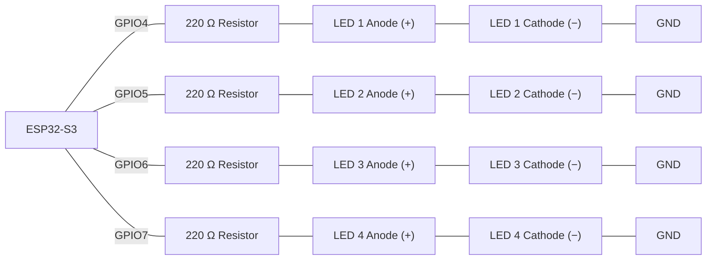
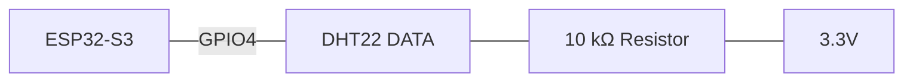
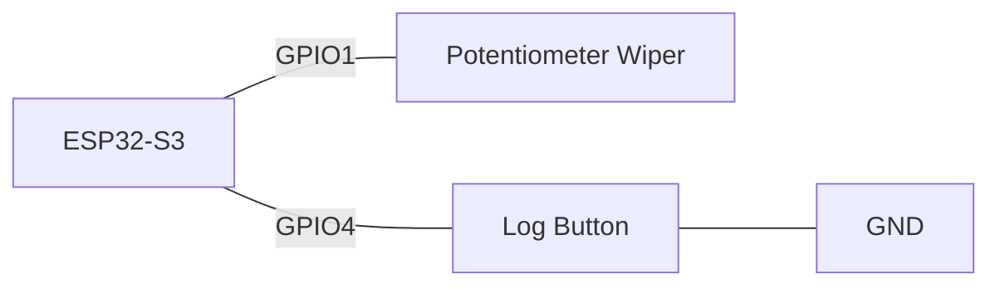
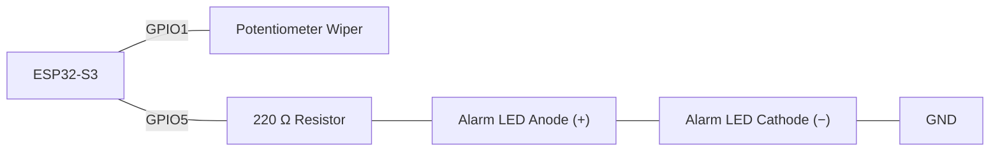
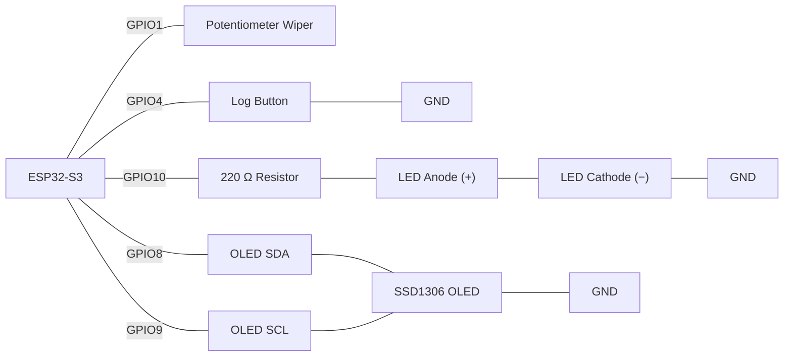

# Activity 6 - Structured Data (Structs & Dictionaries) 

## Task 1 - LED Sequence Driven by an Array of `Step` Structs

**Scenario:**

A control panel's LED sequence needs per-step timing — some LEDs should flash briefly, others should hold longer — so a plain pin array (which assumes every step has the same duration) is no longer enough. Pair each pin with its own duration in one record.

**Components:**

- ESP32-S3 development board
- 4x LED
- 4x 220 Ω resistor
- Jumper wires

> **Wiring:**



Define `struct Step { int pin; int duration; };` and declare `Step sequence[4] = {{4,100},{5,200},{6,100},{7,400}};`. Write `run_sequence()` using a `for` loop over `sequence` that turns each step's LED on for its own `duration` (using `.pin` and `.duration`, not a second array), then off, before moving to the next. `setup()` must configure every pin as `OUTPUT` using a `for` loop over `sequence` — no pin number may appear hard-coded outside the struct array.

>
> Wokwi link: https://wokwi.com/projects/473652460611573761
> 
**Check yourself:**
- [ ] `Step` struct has exactly `pin` and `duration` fields, and the trailing semicolon after the struct definition is present
- [ ] `sequence` is declared as an array of `Step`, not two parallel arrays
- [ ] `run_sequence()` reads each step's own duration via `.duration` — steps are not all the same length
- [ ] `setup()` configures pins with a `for` loop over `sequence`, not hard-coded `pinMode()` calls

**Task 1**
```cpp
/*
=== Task 1 - LED Chaser Using an Array and a For Loop ===
           Author: Roberto Palozzo
=========================================================
*/

struct Step {
  int pin;
  int duration;
};

// Pin dei LED e durata in ms dell'accensione
const int NUM_STEPS = 4;
const Step sequence[NUM_STEPS] = {
  {4,100},
  {5,200},
  {6,100},
  {7,400},
};

void run_sequence() {
  for (int i = 0; i < NUM_STEPS; i++) {
    digitalWrite(sequence[i].pin, HIGH);
    delay(sequence[i].duration);
    digitalWrite(sequence[i].pin, LOW);
    delay(sequence[i].duration);
  }
}

void setup() {  
  for (int i = 0; i < NUM_STEPS; i++) {
    pinMode(sequence[i].pin, OUTPUT);
    digitalWrite(sequence[i].pin, LOW);
  }
}

void loop() {
  run_sequence();
}
```
Wokwi link: https://wokwi.com/projects/474485454691075073

---

## Task 2 - Logging DHT22 Readings as an Array of `Reading` Structs

**Scenario:**

A greenhouse log needs each temperature/humidity capture labelled with what it is, not just a bare number — a printed list of unlabelled floats is useless a day later.

**Components:**

- ESP32-S3 development board
- DHT22 sensor
- 10 kΩ resistor
- Jumper wires

> **Wiring:**



Define `struct Reading { String sensor; float value; String unit; };`. Declare `const int NUM_READINGS = 6;` and `Reading readings[NUM_READINGS];`. In `setup()`, alternate calls to `dht.readTemperature()` and `dht.readHumidity()` (2000 ms apart, guarded with `isnan()` — retry the same slot on a failed read, same pattern as Week 5) to fill the array, storing `"temperature"`/`"C"` or `"humidity"`/`"%"` in each record's `sensor`/`unit` fields alongside its `value`. Print every stored record afterwards using its field names, not index numbers, in the output text.

>
> Wokwi link: https://wokwi.com/projects/473956741868447745
> 
**Check yourself:**
- [ ] `Reading` struct groups `sensor`, `value`, and `unit` together as named fields
- [ ] A failed `isnan()` read is retried into the same slot, not counted as a stored reading
- [ ] The printed output shows each record's `sensor` name and `unit`, not just a bare number
- [ ] Exactly `NUM_READINGS` valid records end up stored, alternating temperature and humidity

**Task 2**
```cpp
/*
=== Task 2 - Logging DHT22 Readings as an Array of Reading Structs ===
                        Author: Roberto Palozzo
======================================================================
*/

#include <DHT.h>
#define DHTTYPE DHT22
#define DHTPIN 4
DHT dht(DHTPIN, DHTTYPE);

struct Reading {
  String sensor;
  float value;
  String unit;
};

const int NUM_READINGS = 6;
Reading readings[NUM_READINGS];

void setup() {
  Serial.begin(115200);
  Serial.println("DHT22 Temperature and Humidity Sensor");
  dht.begin();

  for (int i = 0; i < NUM_READINGS; i++) {
    bool isTemperature = (i %2 == 0);
    float value;
    
    while (true) {
      if (isTemperature) {
        value = dht.readTemperature();
      }
      else {
        value = dht.readHumidity();
      }
      if (isnan(value)) {
        Serial.println("Reading failed, retrying...");
        delay(2000);
      }
      else {
        break;   // valore valido: esci dal while e passa oltre
      }
    }
    readings[i].value = value;
    if (isTemperature) {
      readings[i].sensor = "temperature";
      readings[i].unit = "C";
    } else {
      readings[i].sensor = "humidity";
      readings[i].unit = "%";
    }

    delay(2000);
  }
  
  Serial.println("Readings:");
  for (int i = 0; i < NUM_READINGS; i++) {
    Serial.print(readings[i].sensor);
    Serial.print(": ");
    Serial.print(readings[i].value);
    Serial.println(readings[i].unit);
  }
}  

void loop() {
}
```
Wokwi link: https://wokwi.com/projects/474645438980629505

---

## Task 3 - Min, Max and Average Over a Struct Array's `value` Field

**Scenario:**

A workshop needs the minimum, maximum, and average of a burst of potentiometer readings but each stored record must still carry a label, so the scan needs to reach *into* each struct's `value` field rather than scanning a bare array of numbers.

**Components:**

- ESP32-S3 development board
- Potentiometer
- Jumper wires

> **Wiring:**


Reuse `struct Reading { String sensor; float value; String unit; };` from Task 2. Declare `const int NUM_READINGS = 10;` and `Reading readings[NUM_READINGS];`. In `setup()`, use a `for` loop to fill the array: each iteration builds one record with `sensor = "pot"`, `value = analogRead(potPin)`, `unit = "raw"`, waiting 300 ms between samples. After the capture loop, use a **single** `for` loop to compute the minimum, maximum, and running sum of `readings[i].value` together — initialise `minVal`/`maxVal` from `readings[0].value`, not `0`. Print all three results.

>
> Wokwi link: https://wokwi.com/projects/473955613809115137
> 
**Check yourself:**
- [ ] `readings[]` is an array of `Reading` structs, each one built with `sensor`/`value`/`unit` set together
- [ ] `minVal`/`maxVal` are initialised from `readings[0].value`, not `0`
- [ ] A single `for` loop computes min, max, and sum by reading `readings[i].value` each pass
- [ ] The average uses floating-point division

**Task 3**
```cpp
/*
=== Task 3 - Min, Max and Average Over a Struct Array's value Field ===
                        Author: Roberto Palozzo
=======================================================================
*/

const int potPin = 1;

struct Reading {
  String sensor;
  float value;
  String unit;
};

const int NUM_READINGS = 10;
Reading readings[NUM_READINGS];

void setup() {
  Serial.begin(115200);

  for (int i = 0; i < NUM_READINGS; i++) {
    readings[i].sensor = "pot";
    readings[i].value = analogRead(potPin);
    readings[i].unit = "raw";
    delay(300);
  }

  float minVal = readings[0].value;
  float maxVal = readings[0].value;
  float sum = 0;

  for (int i = 0; i < NUM_READINGS; i++) {
    float v = readings[i].value;
    if (v < minVal) minVal = v;
    if (v > maxVal) maxVal = v;
    sum += v;
  }

  float average = sum / NUM_READINGS;

  Serial.print("Min: ");
  Serial.println(minVal);
  Serial.print("Max: ");
  Serial.println(maxVal);
  Serial.print("Average: ");
  Serial.println(average);
}

void loop() {
}
```
Wokwi link: https://wokwi.com/projects/474663973624519681

---

## Task 4 - Insertion Sort: Keeping a Struct Log Ordered by Timestamp on Every Insert

**Scenario:**

A bench logger must always display its potentiometer readings in time order as they're logged  sorting the whole array from scratch after every single button press wastes work when only the newest entry could ever be out of place.

**Components:**

- ESP32-S3 development board
- Potentiometer
- 1x push button (`INPUT_PULLUP`)
- Jumper wires

> **Wiring:**



Define `struct Reading { unsigned long timestamp; int value; };`. Declare `const int MAX_READINGS = 15;`, `Reading readings[MAX_READINGS];`, and `int reading_count`. Edge-detect the button (a fresh press, not held) to call `log_reading()`: append `{millis(), analogRead(potPin)}` at `readings[reading_count]`, guarded against overflowing `MAX_READINGS`, increment `reading_count`, then run an insertion step a `while` loop that swaps the new record left past any earlier record with a **larger** timestamp — so the array stays sorted by `timestamp` after every single insert. Print the full log after each press.

>
> Wokwi link: https://wokwi.com/projects/473961662656267265

**Check yourself:**
- [ ] Each button press (edge-detected) appends exactly one new record, guarded against exceeding `MAX_READINGS`
- [ ] The insertion step swaps the whole `Reading` struct (both fields together) — never just the timestamp or just the value
- [ ] The `while` loop stops as soon as the new record's correct position is found, not after checking every entry
- [ ] Printing the log after several presses always shows ascending timestamp order

**Task 4**
```cpp
/*
=== Task 4 - Insertion Sort: Keeping a Struct Log Ordered by Timestamp on Every Insert ===
                                Author: Roberto Palozzo
==========================================================================================
*/

const int potPin = 1;
const int buttonPin = 6;

struct Reading {
  unsigned long timestamp;
  int value;
};

const int MAX_READINGS = 15;
Reading readings[MAX_READINGS];
int reading_count = 0;

bool lastButtonState = HIGH;

void log_reading() {
  if (reading_count >= MAX_READINGS) return;

  Reading newReading = {millis(), analogRead(potPin)};
  readings[reading_count] = newReading;
  reading_count++;

  int i = reading_count - 1;
  while (i > 0 && readings[i - 1].timestamp > newReading.timestamp) {
    readings[i] = readings[i - 1];
    i--;
  }
  readings[i] = newReading;
}

void print_log() {
  Serial.println("Log:");
  for (int i = 0; i < reading_count; i++) {
    Serial.print(readings[i].timestamp);
    Serial.print(" ms -> ");
    Serial.println(readings[i].value);
  }
}

void setup() {
  Serial.begin(115200);
  pinMode(buttonPin, INPUT_PULLUP);
}

void loop() {
  bool buttonState = digitalRead(buttonPin);

  if (lastButtonState == HIGH && buttonState == LOW) {
    log_reading();
    print_log();
  }

  lastButtonState = buttonState;
}
```
Wokwi link: https://wokwi.com/projects/474665694970890241

---

## Task 5 - Simulated Dictionary: Looking Up a Per-Sensor Threshold by Name

**Scenario:**

A monitoring bench needs to look up an alarm threshold by sensor name (`"temperature"`, `"humidity"`, `"light"`) rather than by a numeric index staff would have to memorise — a small name-keyed lookup table, searched by name instead of position.

**Components:**

- ESP32-S3 development board
- Potentiometer (used to simulate a selectable sensor reading)
- LED (alarm indicator)
- 220 Ω resistor
- Jumper wires

> **Wiring:**



Define `struct Threshold { String sensor; float limit; };` and declare a `const int NUM_THRESHOLDS = 3;` array initialised with at least `{"temperature", 700.0}`, `{"humidity", 500.0}`, `{"light", 300.0}` (raw ADC-scale placeholder limits). Write `float get_threshold(String sensor)` that linearly searches the array and returns the matching `limit`, or `-1.0` if no entry matches. In `loop()`, read the potentiometer, look up `get_threshold("temperature")`, and light the alarm LED whenever the reading exceeds it. Also call `get_threshold("pressure")` (a sensor **not** in the table) once in `setup()` and print a clear "not found" message when the sentinel comes back — don't let a missing key silently pass through as a usable number.

>
> Wokwi link: https://wokwi.com/projects/473958323838595073

**Check yourself:**
- [ ] `Threshold` struct pairs a `String` key with a numeric `limit`
- [ ] `get_threshold()` walks the array with a `for` loop comparing `.sensor` to the requested key
- [ ] A key that isn't in the table returns the sentinel (`-1.0`), and the caller explicitly checks for it before using the result
- [ ] The alarm LED lights only when the potentiometer reading exceeds the looked-up threshold

**Task 5**
```cpp
/*
=== Task 5 - Simulated Dictionary: Looking Up a Per-Sensor Threshold by Name ===
                                Author: Roberto Palozzo
================================================================================
*/

const int potPin = 1;
const int alarmPin = 5;

struct Threshold {
  String sensor;
  float limit;
};

const int NUM_THRESHOLDS = 3;
Threshold thresholds[NUM_THRESHOLDS] = {
  {"temperature", 700.0},
  {"humidity", 500.0},
  {"light", 300.0},
};

float get_threshold(String sensor) {
  for (int i = 0; i < NUM_THRESHOLDS; i++) {
    if (thresholds[i].sensor == sensor) {
      return thresholds[i].limit;
    }
  }
  return -1.0;
}

void setup() {
  Serial.begin(115200);
  pinMode(alarmPin, OUTPUT);

  float missing = get_threshold("pressure");
  if (missing < 0) {
    Serial.println("Threshold not found for 'pressure'");
  }
}

void loop() {
  int reading = analogRead(potPin);
  float limit = get_threshold("temperature");

  Serial.print("reading: ");
  Serial.print(reading);
  Serial.print(" | limit: ");
  Serial.println(limit);

  if (reading > limit) {
    digitalWrite(alarmPin, HIGH);
  } else {
    digitalWrite(alarmPin, LOW);
  }

  delay(200);
}
```
Wokwi link: https://wokwi.com/projects/475040280829571073

---

## Task 6 - Melody Playback From an Array of `Note` Structs

**Scenario:**

A simple alert tune needs to be defined as data, not as a long sequence of individually hard-coded `tone()`/`delay()` calls so adding or changing a note later means editing one array entry, not restructuring the whole function.

**Components:**

- ESP32-S3 development board
- Passive buzzer
- Jumper wires

> **Wiring:**


Define `struct Note { int frequency; int duration; };` and declare a `Note melody[5]` array of your choosing (frequencies in Hz, durations in ms — at least one repeated frequency to show it's data-driven, not five unique hard-coded calls). Write `play_melody()` using a `for` loop over `melody` that calls `tone(buzzerPin, melody[i].frequency, melody[i].duration)` then waits `melody[i].duration + 50` ms (a short gap) before the next note, and finishes with `noTone(buzzerPin)`. Trigger `play_melody()` once from `setup()`.

>
> Wokwi link:  https://wokwi.com/projects/471515514429761537

**Check yourself:**
- [ ] `Note` struct groups `frequency` and `duration` together as one record
- [ ] `melody[]` is declared as data (an array of `Note`), not five separate `tone()` calls written out by hand
- [ ] `play_melody()` uses a `for` loop reading `.frequency`/`.duration` from each element
- [ ] `noTone()` is called once the loop finishes, and `tone()`/`noTone()` are used — never `digitalWrite()` — on the passive buzzer

**Task 6**
```cpp
/*
=== Task 6 - Melody Playback From an Array of Note Structs ===
                        Author: Roberto Palozzo
=================================================================
*/

const int buzzerPin = 8;

struct Note {
  int frequency;
  int duration;
};

Note melody[5] = {
  {523, 200},
  {659, 200},
  {784, 200},
  {659, 200},
  {523, 400},
};

void play_melody() {
  for (int i = 0; i < 5; i++) {
    tone(buzzerPin, melody[i].frequency, melody[i].duration);
    delay(melody[i].duration + 50);
  }
  noTone(buzzerPin);
}

void setup() {
  play_melody();
}

void loop() {
}
```
Wokwi link:  https://wokwi.com/projects/475088535212271617

---

## Task 7 -  Non-blocking Struct-Based Logging Station With Threshold Lookup

**Scenario:**

Build a bench monitoring station: pressing a Log button records the current potentiometer reading as a sorted, timestamped struct record and flashes a confirmation LED; the OLED always shows the running count, min, max, and average of the log, plus whether the latest reading is above or below a name-looked-up alarm threshold. Nothing may block the button must be read every single pass, even mid-flash.

**Components:**

- ESP32-S3 development board
- Potentiometer
- 1x push button (`INPUT_PULLUP`)
- 1x LED (confirmation/alarm flash)
- 1x 220 Ω resistor
- SSD1306 OLED display (128×64, I²C)
- Jumper wires

> **Wiring:**



**Program requirements — this task combines every concept from this week with Week 4's non-blocking pattern and Week 5's single-pass scan:**
1. **Struct log:** `struct Reading { unsigned long timestamp; int value; };`, stored in `Reading readings[MAX_READINGS]` with `reading_count`, guarded against overflow.
2. **Insertion sort on insert:** `log_reading()` appends the new record then bubbles it left by timestamp, as in Task 4 — never a full re-sort.
3. **Single-pass scan:** `compute_stats()` recalculates min, max, and average over `readings[i].value` in one `for` loop (as in Task 3), called after every new log.
4. **Threshold lookup:** a `Threshold thresholds[]` key-value struct array (as in Task 5) and `get_threshold("pot")` returning the alarm limit for this station.
5. **Non-blocking confirmation/alarm flash:** `start_flash()` turns the LED on and records `millis()`; `update_flash()` — called every pass — turns it off once 150 ms have elapsed. No `delay()`.
6. **Display:** `update_display()` shows count, min, max, average, and whether the latest reading is above or below the looked-up threshold. Redraws on change, or at least every 2000 ms heartbeat.
7. The button is edge-detected and read every pass, independent of the flash or display timing.

>
> Wokwi link: https://wokwi.com/projects/473962280394557441

**Check yourself:**
- [ ] Every logged reading is one `Reading` struct appended and then insertion-sorted by timestamp, guarded against exceeding `MAX_READINGS`
- [ ] `compute_stats()` scans `readings[i].value` in a single pass, initialised from `readings[0].value`
- [ ] `get_threshold()` returns a sentinel for an unknown key, and the caller checks it before using the result
- [ ] The confirmation/alarm LED uses `millis()` (not `delay()`), turning off after 150 ms
- [ ] The OLED shows count/min/max/average and the threshold comparison, redrawing on change or at least every 2000 ms
- [ ] The button is still readable — and a fresh press still registers — while the flash is active

**Task 7**
```cpp
/*
=== Task 7 - Non-blocking Struct-Based Logging Station With Threshold Lookup ===
                                Author: Roberto Palozzo
==================================================================================
*/

#include <Wire.h>
#include <Adafruit_GFX.h>
#include <Adafruit_SSD1306.h>

#define SCREEN_WIDTH 128
#define SCREEN_HEIGHT 64
#define OLED_SDA 8
#define OLED_SCL 9
Adafruit_SSD1306 display(SCREEN_WIDTH, SCREEN_HEIGHT, &Wire, -1);

const int potPin = 1;
const int buttonPin = 4;
const int ledPin = 10;

struct Reading {
  unsigned long timestamp;
  int value;
};

const int MAX_READINGS = 16;
Reading readings[MAX_READINGS];
int reading_count = 0;

struct Threshold {
  String sensor;
  float limit;
};

const int NUM_THRESHOLDS = 1;
Threshold thresholds[NUM_THRESHOLDS] = {
  {"pot", 2000.0},
};

int minVal = 0, maxVal = 0;
float average = 0;

bool lastButtonState = HIGH;

bool flashing = false;
unsigned long flashStart = 0;
const unsigned long FLASH_DURATION = 150;

unsigned long lastDisplayUpdate = 0;
const unsigned long DISPLAY_INTERVAL = 2000;
bool displayDirty = true;

float get_threshold(String sensor) {
  for (int i = 0; i < NUM_THRESHOLDS; i++) {
    if (thresholds[i].sensor == sensor) {
      return thresholds[i].limit;
    }
  }
  return -1.0;
}

void log_reading() {
  if (reading_count >= MAX_READINGS) return;

  Reading newReading = {millis(), analogRead(potPin)};
  readings[reading_count] = newReading;
  reading_count++;

  int i = reading_count - 1;
  while (i > 0 && readings[i - 1].timestamp > newReading.timestamp) {
    readings[i] = readings[i - 1];
    i--;
  }
  readings[i] = newReading;
}

void compute_stats() {
  minVal = readings[0].value;
  maxVal = readings[0].value;
  long sum = 0;

  for (int i = 0; i < reading_count; i++) {
    int v = readings[i].value;
    if (v < minVal) minVal = v;
    if (v > maxVal) maxVal = v;
    sum += v;
  }
  average = (float)sum / reading_count;
}

void start_flash() {
  digitalWrite(ledPin, HIGH);
  flashing = true;
  flashStart = millis();
}

void update_flash() {
  if (flashing && millis() - flashStart >= FLASH_DURATION) {
    digitalWrite(ledPin, LOW);
    flashing = false;
  }
}

void update_display() {
  display.clearDisplay();
  display.setCursor(0, 0);
  display.print("Count: ");
  display.println(reading_count);

  if (reading_count > 0) {
    display.print("Min: ");
    display.println(minVal);
    display.print("Max: ");
    display.println(maxVal);
    display.print("Avg: ");
    display.println(average);

    float limit = get_threshold("pot");
    int latest = readings[reading_count - 1].value;
    display.print(latest > limit ? "ABOVE" : "BELOW");
    display.println(" threshold");
  }

  display.display();
}

void setup() {
  Serial.begin(115200);
  pinMode(buttonPin, INPUT_PULLUP);
  pinMode(ledPin, OUTPUT);

  Wire.begin(OLED_SDA, OLED_SCL);
  display.begin(SSD1306_SWITCHCAPVCC, 0x3C);
  display.setTextSize(1);
  display.setTextColor(SSD1306_WHITE);
  update_display();
}

void loop() {
  bool buttonState = digitalRead(buttonPin);

  if (lastButtonState == HIGH && buttonState == LOW) {
    log_reading();
    compute_stats();
    start_flash();
    displayDirty = true;
  }
  lastButtonState = buttonState;

  update_flash();

  if (displayDirty || millis() - lastDisplayUpdate >= DISPLAY_INTERVAL) {
    update_display();
    lastDisplayUpdate = millis();
    displayDirty = false;
  }
}
```
Wokwi link: https://wokwi.com/projects/473221049759353857

---

## Task 8 - Spot-the-Bug Worksheet (Extension)

For each round, read the snippet and write down what's wrong **before** revealing the answer.

**Round 1:**
```cpp
struct Reading {
  String sensor;
  float value;
}                     // The semicolon is missing in this line after the curly brace.

Reading r = {"temperature", 23.6};
```
<details><summary>Answer</summary>The struct definition is missing its trailing semicolon after the closing brace — <code>struct Reading { ... };</code> needs a <code>;</code> right after <code>}</code>. Without it, the compiler treats what follows as part of the same declaration and fails to compile.</details>

**Round 2:**
```cpp
struct Reading {
  String sensor;
  float value;
  String unit;
};

Reading r = {23.6, "temperature", "C"};    // In this line, the values ​​within the parentheses are swapped.
// The first value corresponds to the float and must be placed in the second position in the list, corresponding to the second field defined in the `Reading` struct.
```
<details><summary>Answer</summary>The initializer list's values are in the wrong order for the declared field order (<code>sensor</code>, then <code>value</code>, then <code>unit</code>). As written, <code>r.sensor</code> ends up holding <code>23.6</code> converted to a string-like value and <code>r.value</code> ends up holding <code>"temperature"</code> — the fields are filled positionally, not by matching type or name, so the initializer values must be listed in the exact same order the struct declares its fields.</details>

**Round 3:**
```cpp
struct Reading {
  unsigned long timestamp;
  int value;
};

Reading readings[10];
int reading_count = 0;

void log_reading(unsigned long t, int v) {
  readings[reading_count].timestamp = t;
  readings[reading_count].value = v;
}
```
<details><summary>Answer</summary><code>reading_count</code> is never incremented inside <code>log_reading()</code> — every call overwrites index 0's fields instead of appending a new record. It needs <code>reading_count++;</code> after both fields are stored.</details>

**Round 4:**
```cpp
float get_threshold(String sensor) {
  for (int i = 0; i < NUM_THRESHOLDS; i++) {
    if (thresholds[i].sensor == sensor) {
      return thresholds[i].limit;
    }
  }
}

void loop() {
  float t = get_threshold("pressure");   // "pressure" is not in the table
  if (analogRead(potPin) > t) {
    digitalWrite(alarmPin, HIGH);
  }
}
```
<details><summary>Answer</summary><code>get_threshold()</code> has no <code>return</code> for the "not found" case — if the loop finishes without a match, the function falls off the end without returning a defined sentinel value, so the caller has nothing reliable to check and the comparison against <code>t</code> uses garbage. It needs a sentinel <code>return -1.0;</code> after the loop, and the caller must check for it (e.g. <code>if (t &lt; 0) { ...handle missing key... }</code>) before using it in the alarm comparison.</details>

**Round 5:**
```cpp
struct Reading {
  unsigned long timestamp;
  int value;
};

Reading readings[MAX_READINGS];
int reading_count = 0;

void log_reading(unsigned long t, int v) {
  if (reading_count >= MAX_READINGS) return;
  readings[reading_count] = {t, v};
  reading_count++;

  int i = reading_count - 1;
  while (i > 0 && readings[i - 1].timestamp > readings[i].timestamp) {
    readings[i] = readings[i - 1];
    i--;
  }
}
```
<details><summary>Answer</summary>Inside the insertion-sort <code>while</code> loop, only <code>readings[i] = readings[i - 1]</code> is assigned — the original new record (which was sitting at the starting index before the loop began) is never saved into a temporary first, so it's overwritten and effectively lost as soon as the first swap happens, rather than being placed into its correct final slot. The new record needs to be held in a temporary <code>Reading</code> variable before the loop, and written into place (<code>readings[i] = temp;</code>) once the loop finds where it belongs.</details>

**Round 6:**
```cpp
struct Reading {
  String sensor;
  float value;
};

Reading a = {"temperature", 23.6};
Reading b = {"temperature", 23.6};

if (a == b) {
  Serial.println("Readings match");
}
```
<details><summary>Answer</summary>C++ does not automatically generate an <code>==</code> comparison for a user-defined struct — comparing two struct variables directly with <code>==</code> is a compile error (or, in some setups, compares raw memory rather than field values) unless <code>operator==</code> is explicitly defined for that struct. Each field must be compared individually instead, e.g. <code>if (a.sensor == b.sensor && a.value == b.value)</code>.</details>

**Round 7:**
```cpp
struct Threshold {
  String sensor;
  float limit;
};

const int NUM_THRESHOLDS = 3;
Threshold thresholds[NUM_THRESHOLDS] = {
  {"temperature", 28.0},
  {"humidity", 70.0},
};
```
<details><summary>Answer</summary>The array is declared to hold 3 elements (<code>NUM_THRESHOLDS = 3</code>) but only 2 are initialised. The third element, <code>thresholds[2]</code>, is default-constructed (an empty <code>String</code> key and <code>0.0</code> limit) rather than a real entry — a search for a valid sensor name will never match it, but it silently occupies a slot and could be mistaken for real data if the array is looped over blindly. Either add the missing third entry or set <code>NUM_THRESHOLDS</code> to match the number of entries actually provided.</details>

---

## Questions

Answer these in your own words before moving on:

1. What is the advantage of a `struct` record over two parallel arrays holding the same data, in terms of the bugs it makes impossible?
   ```


   ```

2. Why does a struct definition need a trailing semicolon after its closing brace, when a function definition does not?
   ```


   ```

3. Why is a linear search over a small key-value struct array an acceptable stand-in for a dictionary on a microcontroller, when it would not scale well for a table of thousands of entries?
   ```


   ```

4. Why must a lookup function like `get_threshold()` return a sentinel value for "not found," and what must every caller do with that return value before using it?
   ```


   ```

5. In an insertion sort performed on every new record, why does only the newly-inserted record ever need to move, rather than re-checking the whole array?
   ```


   ```

6. Why can't two struct variables be compared directly with `==` in C++ the way two `int` variables can?
   ```


   ```
